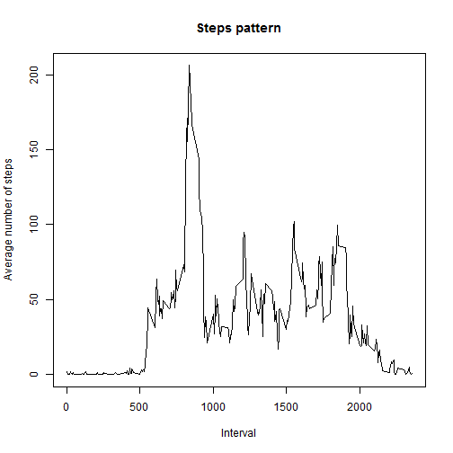

##This is a solution for the peer assignment 1.

###Loading and preprocessing the data

```r
#Here is an R chunck
setwd("C:/Coursera/Reproducible data analysis/Assignment1/Git")
datafile<-read.csv("activity.csv")
```
Now the data is downloaded in dataframe 'datafile'.

### What is mean total number of steps taken per day?
On the next step total number of steps taken per day will be calculated into new data frame 'stepsbyday'.
'dplyr' package will be used to group data and summarize.


```r
library(dplyr,warn.conflicts = FALSE)
#data is grouped by date and than summarize is being applieddataframe
stepsbydate<-summarize(group_by(datafile,date),Total_steps_per_day=sum(steps))
hist(stepsbydate$Total_steps_per_day,xlab='Total steps per day',main='Steps per day')
```

 

Now we can calculate mean and median of total number of steps taken per day.
        First lets calculate the mean.

```r
mean_number_of_steps= mean(stepsbydate$Total_steps_per_day,na.rm=TRUE)
mean_number_of_steps
```

```
## [1] 10766.19
```
Next lets calculate the median:

```r
median_number_of_steps= median(stepsbydate$Total_steps_per_day,na.rm=TRUE)
median_number_of_steps
```

```
## [1] 10765
```
We can even report it inline. Mean number of steps per day is 1.0766189 &times; 10<sup>4</sup> and medium number of steps is 10765.

Note: I should say that floating point number for 'mean' looks a bit weird in its scientific notation. Formatting can probably be fixed but I do not know how.

### What is the average daily activity pattern?
First we will make a time series plot of the 5 minutes intervals and the average number of steps taken (x), averaged across all days (y).
We will use the same approach with dplyr package we used to calculate total number of steps per day.


```r
stepsbyinterval<-summarize(group_by(datafile,interval),Average_steps=mean(steps,na.rm=TRUE))
plot(stepsbyinterval$interval,stepsbyinterval$Average_steps,xlab='Interval',ylab='Average number of steps', main='Steps pattern',type="l")
```

 

Let's figure out what interval has the maximum number of steps on average.


```r
max_interval <- stepsbyinterval$interval[which.max(stepsbyinterval$Average_steps)]
```

So the 5 minutes interval with maximum number of steps on average is 835, which makes sense as it is most probaly 8.35 AM in the morning and good time for a run.

### Imputing missing values

Lets calculate the number of missing values in the dataset.


```r
missing_rows<-sum(is.na(datafile$steps))
```
So we do not have data on 2304 rows.

Lets replace missing values with average (i.e. mean) number of steps usually taken in this time interval. This average number is usually floating point number and will be rounded to the nearest integer.
We will compute it into new database 'datafile2'. 


```r
datafile2<-datafile
L<-dim(datafile2)[1]
for (i in 1:L) {
        if (is.na(datafile2$steps[i])){
                datafile2$steps[i]<-round(stepsbyinterval$Average_steps[stepsbyinterval$interval==datafile$interval[i]],digits=0)
        }
# Average number is rounded to the nearest integer as number of steps is usually integer
}
```

Now we will repeat histogram and calculation of mean and median for a new database.


```r
library(dplyr,warn.conflicts = FALSE)
#data is grouped by date and than summarize is being applieddataframe
stepsbydate2<-summarize(group_by(datafile2,date),Total_steps_per_day=sum(steps))
hist(stepsbydate2$Total_steps_per_day,xlab='Total steps per day',main='Steps per day(corrected)')
```

 

Now we can calculate mean and median of total number of steps taken per day in the corrected dataset.
        First lets calculate the mean.

```r
mean_number_of_steps2= mean(stepsbydate2$Total_steps_per_day,na.rm=TRUE)
mean_number_of_steps2
```

```
## [1] 10765.64
```
Next lets calculate the median in the corrected dataset:

```r
median_number_of_steps2= median(stepsbydate2$Total_steps_per_day,na.rm=TRUE)
median_number_of_steps2
```

```
## [1] 10762
```
Now we can compare old and new results inline. Mean number of steps per day was 1.0766189 &times; 10<sup>4</sup> and after correction is 1.0765639 &times; 10<sup>4</sup>.

Median number of steps was 10765 and after correction is 1.0762 &times; 10<sup>4</sup> (again the inline number looks weird).

As one can see the proposed correction did not change the mean and median much. What is interesting the corrected values are somewhat lower than initial data. This seems counterintuitive. Lets try to find number of missing dates in original and corrected datsets.

```r
Number_of_missing_dates <-sum(is.na(stepsbydate$Total_steps_per_day))
Number_of_missing_dates
```

```
## [1] 8
```

```r
Number_of_missing_dates2 <-sum(is.na(stepsbydate2$Total_steps_per_day))
Number_of_missing_dates2
```

```
## [1] 0
```


The explanation is in the fact that new dataset has values for 8 more days which were missing in the original dataset. And even thoug total number of steps in database is increased number of days with data increased as well.


### Are there changes in activity patterns between weekdays and weekends

Lets add day of the week information to the corrected dataset


```r
aWeekDay<-weekdays(strptime(datafile2$date,format("%Y-%m-%d ")))
weekD<-rep("",L)
for (i in 1:L) {
        if (aWeekDay[i] %in% c("Saturday","Sunday")) {
                weekD[i]<-"weekend"
             }
            else {
                 weekD[i]<-"weekday"
            }
                  
        }
datafile2<-cbind(datafile2,weekD)
```

Now it is time to plot a comparison. I am going to use ggplot2 package


```r
library(ggplot2)
#Now we group not only by interval but also by weekend/weekday
stepsbyinterval2<-summarize(group_by(datafile2,interval,weekD),Average_steps=mean(steps,na.rm=TRUE))

g<-ggplot(stepsbyinterval2,aes(interval,Average_steps))+geom_line(size=1)
g<-g+facet_grid(weekD~.,scales="free")
g<-g+labs(x="Interval",y="Average number of steps")
g<-g+labs(title=expression("Steps profiling weekends or weekdays"))
g
```

 
